# 🚀 CloudOps-Next-Deployment: Complete DevOps Project from Zero to Production

<div align="center">
  
  
  
  
  
  
</div>

---

<div align="center">
  
  ## 🚀 Project Overview
  
  <table>
    <tr>
      <td width="30%" align="center">
        
        <br><b>AWS Cloud</b>
      </td>
      <td width="40%" align="center">
        <h3>⚡ Highly Available · Scalable · Production-Ready ⚡</h3>
        <p><i>AWS Architecture with Terraform & Docker</i></p>
      </td>
      <td width="30%" align="center">
        
        <br><b>Containerized</b>
      </td>
    </tr>
  </table>
  
  <p align="center">
    This project demonstrates a <b>highly available, scalable, and production-ready</b> cloud architecture on <b>AWS</b> using <b>Terraform</b> and <b>Docker</b>.
  </p>
  
  <p align="center">
    The application is a <b>containerized Node.js web app</b> deployed behind an <b>Application Load Balancer</b> with <b>Auto Scaling</b> across multiple <b>Availability Zones</b>.
  </p>
  
</div>


## 🌟 The Vision
<div align="center"> <table width="100%" border="0"> <tr> <td width="60%" valign="top"> <h3>From Code to Cloud ☁️</h3> <p>This project represents a <b>complete DevOps implementation</b> that transforms a static event management website into a production-ready, scalable AWS deployment.</p> <p><b>🎪 The Client:</b> "Elegant Events" – A premium event management company specializing in:</p>
    <ul>
      <li>💍 <b>Weddings</b> – Dream celebrations</li>
      <li>🎉 <b>Parties</b> – Memorable gatherings</li>
      <li>💑 <b>Anniversaries</b> – Timeless love</li>
      <li>🏢 <b>Corporate Events</b> – Professional excellence</li>
    </ul>
  </td>
  <td width="40%" align="center">
    <!-- Stats Card -->
    <table border="1" cellpadding="10" style="border-radius: 15px; background: linear-gradient(145deg, #f6f9fc 0%, #e6f0f5 100%);">
      <tr><td align="center"><h3>📊 PROJECT STATS</h3></td></tr>
      <tr><td align="center"><h1>7</h1>Pages</td></tr>
      <tr><td align="center"><h1>6</h1>Phases</td></tr>
      <tr><td align="center"><h1>4</h1>AWS Services</td></tr>
      <tr><td align="center"><h1>∞</h1>Scalability</td></tr>
    </table>
  </td>
</tr>
</table> 
</div>
<h2 align="center" >
🏗️ Architecture Diagram
</h2>


## 🛠️ Technologies Used

| Category | Technologies |
|----------|-------------|
| **Frontend** | HTML5, CSS3, JavaScript, Font Awesome, Google Fonts |
| **Containerization** | Docker, Docker Hub |
| **Infrastructure as Code** | Terraform |
| **Cloud Provider** | AWS (VPC, EC2, EBS, S3, IAM) |
| **CI/CD** | GitHub Actions |
| **Web Server** | Nginx |
| **OS** | Ubuntu 20.04 LTS |
| **Version Control** | Git, GitHub |


## 🌐 Cloud-Native Infrastructure Specification

<div align="center">
<!-- Badges -->   <!-- Decorative Line --><hr width="100%" style="height:2px; border-width:0; background: linear-gradient(90deg, #FF9900, #232F3E, #FF9900);"></div>

## 🏗️ Infrastructure Overview

<div align="center"><table width="100%" style="border-radius: 15px; overflow: hidden; box-shadow: 0 10px 30px rgba(0,0,0,0.1);"> <tr> <td colspan="2" style="background: linear-gradient(135deg, #232F3E 0%, #FF9900 100%); padding: 20px;"> <h3 align="center" style="color: white;">📋 ARCHITECTURE COMPONENTS</h3> </td> </tr> <tr> <td width="50%" valign="top" style="padding: 20px; background: #f8f9fa;"> <h3 align="center">🌐 NETWORKING</h3> <p align="center"><i>Custom VPC for Resource Isolation</i></p> <ul> <li><b>VPC:</b> Custom CIDR block (10.0.0.0/16)</li> <li><b>Public Subnets:</b> 2x (Multi-AZ) for ALB & NAT</li> <li><b>Private Subnets:</b> 2x (Multi-AZ) for Application Tier</li> <li><b>Internet Gateway:</b> Public internet access</li> <li><b>NAT Gateway:</b> Outbound access for private instances</li> <li><b>Route Tables:</b> Public & Private dedicated routing</li> </ul> </td> <td width="50%" valign="top" style="padding: 20px; background: #ffffff;"> <h3 align="center">⚖️ LOAD BALANCING</h3> <p align="center"><i>Traffic Entry Point & Health Monitoring</i></p> <ul> <li><b>Type:</b> Application Load Balancer (ALB)</li> <li><b>Target Group:</b> EC2 instance routing logic</li> <li><b>Listener:</b> HTTP (Port 80) configuration</li> <li><b>Health Checks:</b> Automated instance monitoring</li> <li><b>Distribution:</b> Even traffic spread across AZs</li> </ul> </td> </tr> <tr> <td width="50%" valign="top" style="padding: 20px; background: #ffffff;"> <h3 align="center">📈 AUTO SCALING</h3> <p align="center"><i>Demand-Based Capacity Management</i></p> <ul> <li><b>Launch Template:</b> AMI, Instance Type, Configuration</li> <li><b>Auto Scaling Group:</b> <ul> <li>Minimum: 2 instances</li> <li>Maximum: 3 instances</li> <li>Multi-AZ distribution</li> </ul> </li> <li><b>Self-Healing:</b> Automatic replacement on failure</li> </ul> </td> <td width="50%" valign="top" style="padding: 20px; background: #f8f9fa;"> <h3 align="center">🖥️ COMPUTE</h3> <p align="center"><i>Application Processing Layer</i></p> <ul> <li><b>Location:</b> Private Subnets only</li> <li><b>Instance Type:</b> t3.micro (configurable)</li> <li><b>Provisioning:</b> Docker via user_data script</li> <li><b>Deployment:</b> Auto-container deployment on launch</li> <li><b>Isolation:</b> No direct internet exposure</li> </ul> </td> </tr> <tr> <td width="50%" valign="top" style="padding: 20px; background: #f8f9fa;"> <h3 align="center">🔐 SECURITY & IAM</h3> <p align="center"><i>Defense in Depth & Least Privilege</i></p> <ul> <li><b>ALB Security Group:</b> HTTP (80) from anywhere</li> <li><b>EC2 Security Group:</b> ALB traffic only</li> <li><b>SSH Access:</b> Restricted to specific IP</li> <li><b>IAM Role:</b> EC2 with S3 access only</li> <li><b>Principle:</b> Least privilege enforcement</li> </ul> </td> <td width="50%" valign="top" style="padding: 20px; background: #ffffff;"> <h3 align="center">☁️ STORAGE</h3> <p align="center"><i>Persistent & Object Storage</i></p> <ul> <li><b>EBS Volumes:</b> <ul> <li>10GB block storage</li> <li>Attached to EC2 instances</li> <li>Persistent data storage</li> </ul> </li> <li><b>S3 Bucket:</b> <ul> <li>Backup storage</li> <li>Static assets</li> <li>Versioning enabled</li> </ul> </li> </ul> </td> </tr> </table></div>

---

## 📅 Complete Project Timeline

### Phase 1: Website Development
<table align="center"> <tr> <td width="50" align="center">🎨</td> <td><b>7-Page Responsive Design</b> - Event management platform</td> </tr> <tr> <td align="center">📱</td> <td><b>Mobile Optimized</b> - Media queries for all devices</td> </tr> <tr> <td align="center">⚡</td> <td><b>Interactive Elements</b> - JavaScript animations & forms</td> </tr> <tr> <td align="center">🔤</td> <td><b>Typography</b> - Playfair Display + Poppins fonts</td> </tr> </table><p align="center">  </p>

### Phase 2: Docker Containerization
<table align="center"> <tr> <td width="50" align="center">📦</td> <td><b>Dockerfile</b> - Nginx base configuration</td> </tr> <tr> <td align="center">🔄</td> <td><b>Static Serving</b> - Optimized file delivery</td> </tr> <tr> <td align="center">✅</td> <td><b>Local Testing</b> - Verified container functionality</td> </tr> <tr> <td align="center">☁️</td> <td><b>Docker Hub</b> - Image pushed to registry</td> </tr> </table><p align="center">  </p>

### Phase 3: Terraform Infrastructure Design
<div align="center"> <table> <tr> <th colspan="2" align="center">INFRASTRUCTURE COMPONENTS</th> </tr> <tr> <td width="200">🌠VPC</td> <td>Custom network with subnets</td> </tr> <tr> <td>🔒 Security Groups</td> <td>Ports 22, 80, 443 configured</td> </tr> <tr> <td>🔑 IAM Roles</td> <td>S3 access policies</td> </tr> <tr> <td>💾 EBS Volume</td> <td>10GB persistent storage</td> </tr> <tr> <td>📜 user_data</td> <td>Bootstrap script for EC2</td> </tr> </table> </div><p align="center">  </p>

### Phase 4: AWS Resource Deployment
<div align="center"> <table> <tr> <th align="center">RESOURCE</th> <th align="center">CONFIGURATION</th> <th align="center">STATUS</th> </tr> <tr> <td>VPC</td> <td>10.0.0.0/16</td> <td>✅ ACTIVE</td> </tr> <tr> <td>EC2</td> <td>t3.micro (Ubuntu)</td> <td>✅ RUNNING</td> </tr> <tr> <td>EBS</td> <td>10GB attached</td> <td>✅ MOUNTED</td> </tr> <tr> <td>S3</td> <td>Versioned bucket</td> <td>✅ CREATED</td> </tr> </table> </div><p align="center">  </p>

### Phase 5: CI/CD Pipeline Setup

```mermaid
graph LR
    A[📝 Push to Main] --> B[🔍 TEST<br/>HTML/CSS]
    B --> C[🏗️ BUILD<br/>Docker Image]
    C --> D[🚀 DEPLOY<br/>Terraform]
    D --> E[🌐 LIVE<br/>Site]
    
    B --> F{✅ Tests Pass?}
    F -->|Yes| C
    F -->|No| G[❌ Failed]
    
    style A fill:#e1f5fe,stroke:#01579b
    style B fill:#fff3e0,stroke:#e65100
    style C fill:#e8f5e8,stroke:#1b5e20
    style D fill:#ffebee,stroke:#c62828
    style E fill:#f3e5f5,stroke:#4a148c
    style F fill:#ffe0b2,stroke:#bf360c
```


| Component | Description | Status |
|-----------|-------------|--------|
| ⚙️ **GitHub Actions** | Automated workflow runner | ✅ Active |
| 🔐 **Secrets** | AWS + Docker credentials encrypted | ✅ Configured |
| 🚀 **Auto-deploy** | Triggers on push to main branch | ✅ Enabled |

<p align="center">
  
</p>

### Phase 6: Testing & Validation
<div align="center"> <table> <tr> <th align="left">COMPONENT</th> <th align="center">TEST</th> <th align="center">RESULT</th> </tr> <tr> <td>🌠Website</td> <td>Accessibility</td> <td>🟢 ONLINE</td> </tr> <tr> <td>🳠Docker</td> <td>Container status</td> <td>🟢 RUNNING</td> </tr> <tr> <td>💾 EBS</td> <td>Mount point</td> <td>🟢 MOUNTED</td> </tr> <tr> <td>☁️ S3</td> <td>Backup sync</td> <td>🟢 SYNCED</td> </tr> <tr> <td>🔠SSH</td> <td>Connectivity</td> <td>🟢 SECURE</td> </tr> </table> </div><p align="center">  </p>

## 📂 Project Structure

This project follows a modular Terraform architecture to ensure scalability and ease of management.

```bash
CloudOps-Next-Deployment/
├── 🌐 event-website/           # Application source code
│   ├── 📁 public/              # Static assets (images, css, js)
│   ├── 📁 pages/               # HTML content (about, contact, etc.)
│   ├── 📄 Dockerfile           # Containerization configuration
│   ├── 📄 package.json         # Node.js dependencies
│   └── 📄 server.js            # Application entry point
├── 🏗️ terraform/               # Infrastructure as Code
│   ├── 📄 alb.tf               # Application Load Balancer config
│   ├── 📄 autoscaling.tf       # ASG and Launch Template logic
│   ├── 📄 compute.tf           # EC2 instance specifications
│   ├── 📄 network.tf           # VPC, Subnets, and Gateways
│   ├── 📄 security.tf          # Security Groups and IAM Roles
│   ├── 📄 storage.tf           # S3 and EBS configurations
│   ├── 📄 provider.tf          # AWS provider settings
│   ├── 📄 variables.tf         # Input variable definitions
│   └── 📄 outputs.tf           # Infrastructure output values
├── 📜 user_data.sh             # Script for automated Docker installation
└── 📄 README.md                # Project documentation
```


## 📋 Prerequisites

Before starting, ensure you have:

### Required Accounts
- [ ] **AWS Account** - Sign up at [aws.amazon.com](https://aws.amazon.com)
- [ ] **Docker Hub Account** - Sign up at [hub.docker.com](https://hub.docker.com)
- [ ] **GitHub Account** - Sign up at [github.com](https://github.com)

### Required Software (Install on Local Machine)
```bash
# Check if installed, install if missing

# AWS CLI
aws --version
# If not installed:
curl "https://awscli.amazonaws.com/awscli-exe-linux-x86_64.zip" -o "awscliv2.zip"
unzip awscliv2.zip
sudo ./aws/install

# Terraform
terraform --version
# If not installed:
wget -O- https://apt.releases.hashicorp.com/gpg | gpg --dearmor | sudo tee /usr/share/keyrings/hashicorp-archive-keyring.gpg
echo "deb [signed-by=/usr/share/keyrings/hashicorp-archive-keyring.gpg] https://apt.releases.hashicorp.com $(lsb_release -cs) main" | sudo tee /etc/apt/sources.list.d/hashicorp.list
sudo apt update && sudo apt install terraform

# Docker
docker --version
# If not installed:
curl -fsSL https://get.docker.com -o get-docker.sh
sudo sh get-docker.sh
sudo usermod -aG docker $USER
# Logout and login again

# Git
git --version
# If not installed:
sudo apt install git -y

```


## 🐳 Docker Image
Docker Image Used:

```bash
kanvit279/cloudops-next-deployment:v2
```

## 🚀 Deployment Steps
## 1️⃣ Clone Repository
```bash
git clone https://github.com/<your-username>/<repo-name>.git
cd terraform
```

## 2️⃣ Initialize Terraform

```bash
git clone https://github.com/<your-username>/<repo-name>.git
cd terraform
```

## 3️⃣ Preview Infrastructure Plan

```bash
terraform plan
```


## 4️⃣ Deploy Infrastructure

```bash
terraform apply
```

Type:
```bash
yes
```

Terraform will provision:

- VPC

- Subnets

- NAT Gateway

- Load Balancer

- Auto Scaling Group

- EC2 Instances

- S3 Bucket

- IAM Roles

## 5️⃣ Access the Application

After deployment, Terraform outputs:

```bash
website_url = http://<ALB-DNS>
```
website_url = http://<ALB-DNS>

---

## 🔄 Updating Application Version
To deploy a new Docker version:

1. Build new image:
```bash
docker build -t kanvit279/cloudops-next-deployment:v3 .
```

2. Push to Docker Hub:
```bash
docker push kanvit279/cloudops-next-deployment:v3
```
3. Update variables.tf:
```bash
default = "kanvit279/cloudops-next-deployment:v3"
```
4. Run:
```bash
terraform apply
```
Auto Scaling will launch new instances with updated image.

## 💰 Cost Considerations

This architecture includes:

- NAT Gateway (incurs hourly cost)

- Load Balancer

- 2 EC2 instances (minimum)

Recommended for learning/demo purposes only.
Destroy resources when not in use:
```bash
terraform destroy
```

## 🔐 Security & High Availability Design
<div align="center">   
 </div>
<h1 align="center">  </h1>


## 🏰 SECURITY ARCHITECTURE
<div align="center">
  

</div>


## 📡 NETWORK SECURITY LAYERS
<div align="center"> <table> <tr> <th width="200" align="center">LAYER</th> <th width="300" align="center">COMPONENT</th> <th align="center">PROTECTION</th> </tr> <tr> <td align="center"><b>🌐 LAYER 1</b></td> <td align="center">Internet Gateway</td> <td>⬆️ Inbound traffic control</td> </tr> <tr> <td align="center"><b>🛡️ LAYER 2</b></td> <td align="center">ALB Security Group</td> <td>🔓 Port 80 only</td> </tr> <tr> <td align="center"><b>🔒 LAYER 3</b></td> <td align="center">EC2 Security Group</td> <td>🚫 ALB access only</td> </tr> <tr> <td align="center"><b>📦 LAYER 4</b></td> <td align="center">Private Subnets</td> <td>🏠 No direct internet</td> </tr> <tr> <td align="center"><b>🔑 LAYER 5</b></td> <td align="center">IAM Roles</td> <td>📋 Least privilege</td> </tr> </table> </div>

## 🎯 SECURITY IMPLEMENTATION
<div align="center"> <table> <tr> <td width="50" align="center">🏭</td> <td><b>Private Subnet Deployment</b><br>EC2 instances are isolated from direct internet exposure</td> <td align="center">🟢 ACTIVE</td> </tr> <tr> <td align="center">🚦</td> <td><b>ALB Traffic Gateway</b><br>Single entry point for all inbound HTTP traffic</td> <td align="center">🟢 ACTIVE</td> </tr> <tr> <td align="center">🌊</td> <td><b>NAT Gateway Egress</b><br>Controlled outbound internet access for updates</td> <td align="center">🟢 ACTIVE</td> </tr> <tr> <td align="center">👤</td> <td><b>IP-Restricted SSH</b><br>Admin access limited to authorized IP only</td> <td align="center">🟢 ACTIVE</td> </tr> <tr> <td align="center">📎</td> <td><b>S3-Scoped IAM</b><br>Instance role limited to specific bucket operations</td> <td align="center">🟢 ACTIVE</td> </tr> </table> </div><p align="center">  </p>
<div align="center">  </div>

## ⚡ HIGH AVAILABILITY FEATURES
<div align="center">   


<table> <tr> <td align="center" width="200"> <br> <b>Multi-AZ</b> </td> <td align="center" width="200"> <br> <b>Auto Scaling</b> </td> <td align="center" width="200"> <br> <b>Load Balancer</b> </td> <td align="center" width="200"> <br> <b>Health Checks</b> </td> </tr> </table></div>

## 📊 AVAILABILITY MATRIX
<div align="center"> <table> <tr> <th>FEATURE</th> <th>IMPLEMENTATION</th> <th>BENEFIT</th> <th>STATUS</th> </tr> <tr> <td><b>📍 Multi-AZ</b></td> <td>2 Availability Zones</td> <td>Zone failure tolerance</td> <td>✅ ENABLED</td> </tr> <tr> <td><b>📈 Auto Scaling</b></td> <td>2-3 instances</td> <td>Demand-based capacity</td> <td>✅ CONFIGURED</td> </tr> <tr> <td><b>❤️ Health Checks</b></td> <td>Target Group monitoring</td> <td>Automatic failure detection</td> <td>✅ ACTIVE</td> </tr> <tr> <td><b>⚖️ Load Balancing</b></td> <td>ALB distribution</td> <td>Even traffic spread</td> <td>✅ RUNNING</td> </tr> <tr> <td><b>🔄 Self-Healing</b></td> <td>Auto replacement</td> <td>Zero manual intervention</td> <td>✅ ENABLED</td> </tr> </table> </div>
<div align="center">  </div>
<div align="center">  </div>

## 🚀 FUTURE ENHANCEMENTS
<div align="center"> <table> <tr> <td width="60" align="center" bgcolor="#f0f0f0">🔒</td> <td width="300"><b>HTTPS with ACM</b></td> <td>SSL/TLS certificate integration</td> <td>📅 Planned</td> </tr> <tr> <td align="center">🌍</td> <td><b>Route53 Custom Domain</b></td> <td>DNS management with custom domain</td> <td>📅 Planned</td> </tr> <tr> <td align="center">🗄️</td> <td><b>Remote Terraform State</b></td> <td>S3 backend with DynamoDB locking</td> <td>📅 Planned</td> </tr> <tr> <td align="center">⚙️</td> <td><b>CI/CD Pipeline</b></td> <td>GitHub Actions automation</td> <td>📅 Planned</td> </tr> <tr> <td align="center">🔄</td> <td><b>Blue/Green Deployment</b></td> <td>Zero-downtime updates</td> <td>📅 Planned</td> </tr> </table> <br> </div>
<div align="center">  </div>

## 🧹 INFRASTRUCTURE CLEANUP
<div align="center"> <h3>⚠️ DESTROY COMMAND</h3> <pre align="center" style="background: #1e1e1e; padding: 20px; border-radius: 10px; color: #00ff00;"> <code> # Remove all resources terraform destroy # Auto-approve (use with caution!) terraform destroy -auto-approve </code> </pre> <table> <tr> <td align="center">⏱️ <b>Estimated time:</b></td> <td>2-3 minutes</td> </tr> <tr> <td align="center">🔄 <b>Resources removed:</b></td> <td>VPC, EC2, EBS, S3, Security Groups, IAM</td> </tr> <tr> <td align="center">⚠️ <b>Warning:</b></td> <td>This action cannot be undone</td> </tr> </table></div>
<div align="center">  </div>

## 👨‍💻 AUTHOR
<div align="center">  <br> 


<table> <tr> <td align="center"></td> <td><b>AWS</b> - Certified Professional</td> </tr> <tr> <td align="center"></td> <td><b>Docker</b> - Container Specialist</td> </tr> <tr> <td align="center"></td> <td><b>Terraform</b> - Infrastructure as Code</td> </tr> <tr> <td align="center"></td> <td><b>Auto Scaling & Load Balancing</b> - High Availability Expert</td> </tr> </table></div>
<div align="center">  </div>

## ⭐ FINAL DEPLOYMENT RESULT
<div align="center"> 


<table> <tr> <td align="center" width="150"><b>✅ Multi-AZ</b></td> <td align="center" width="150"><b>✅ Load Balancing</b></td> <td align="center" width="150"><b>✅ Auto Scaling</b></td> </tr> <tr> <td align="center"><b>✅ Private Subnets</b></td> <td align="center"><b>✅ NAT Gateway</b></td> <td align="center"><b>✅ Secure Infrastructure</b></td> </tr> <tr> <td align="center" colspan="2"><b>✅ Containerized Application</b></td> <td align="center"><b>✅ S3 Backups</b></td> </tr> </table>


 <h3>✨ SECURE · SCALABLE · HIGH AVAILABILITY ✨</h3></div>


